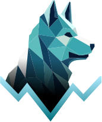
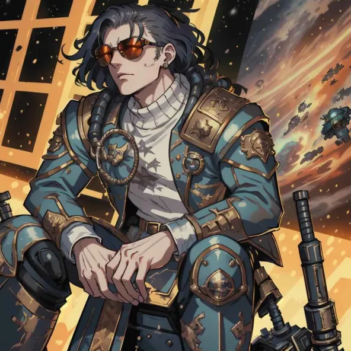

<!-- <div style="text-align:center"> -->
<p align="center">

</p>
<h1 align="center">Doggy_icon</h1>
<!-- </div> -->

This is an icon resource library designed with a focus on backtesting projects.

---

### Installation

Install doggy_icon using yarn

```bash
yarn add doggy_icon
```

npm

```bash
npm i doggy_icon
```

or pnpm

```bash
pnpm i doggy_icon
```

### Usage

```js
import DoggyIcon from "doggy_icon";

<DoggyIcon icon="search" />;
```

### Options

- icon
- size: small | medium | large
- colorType: primary | destructive | safe | warning | info
- style

If you need to customize properties, you can enter your custom properties in the "style".

### Contributor

<table>
  <tr>
    <td align="center" valign="top" width="14.28%">
      <a href="https://github.com/janlin002">
        
        <br />
        <sub><b>janlin002</b></sub>
      </a>
      <br />
      <a href="#developer-janlin002" title="Design">💻</a>
    </td>
    <!-- <td align="center">
      <a href="https://joanna-design.myportfolio.com/about">
        
        <br />
        <sub><b>joanna</b></sub>
      </a>
      <br />
      <a href="#talk-saplingt" title="Talks">🎨</a>
    </td> -->
    <td align="center" valign="top" width="14.28%">
      <a href="https://joanna-design.myportfolio.com/about">
        
        <br />
        <sub><b>joanna</b></sub>
      </a>
        <br />
        <a href="#designer-joanna" title="Design">🎨</a>
    </td>
      <td align="center" valign="top" width="14.28%">
      <a href="https://github.com/ottovenliu">
        
        <br />
        <sub><b>otto</b></sub>
      </a>
        <br />
        <a href="#developer-otto" title="Design">💻</a>
    </td>
  </tr>
</table>
